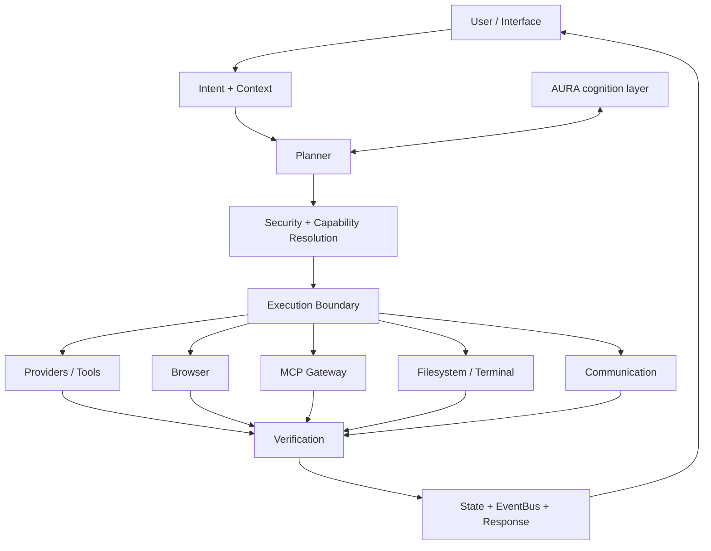

<p align="center">

</p>

<p align="center">

</p>

<p align="center">


</p>

# KIO — Kernel for Intelligent Orchestration

> **Current engineering status — September 26, 2026:** **Active restoration / integration + convergence audit.** Gate 5 is not the current completion state. The repository is being reconciled against its Constitution and Master Convergence Plan; historical Gate 5 artifacts are evidence, not a project-wide completion claim. The repository's Constitution still defines an evidence-driven audit and Master Convergence Plan as the current phase mandate.

> **KIO (Kernel for Intelligent Orchestration)** is a modular, local-first execution kernel that turns user intent into real actions through explicit planning, capability resolution, security gates, provider dispatch, execution, and verification. It is designed as the execution layer of the broader KIO/AURA architecture: cognition can reason about ambiguity, while KIO owns deterministic execution, safety, state, and proof that important side effects actually occurred.

KIO is the execution and orchestration layer of the broader KIO/AURA system. It is designed around:

**Observe → Reason → Plan → Execute → Verify → Adapt**

KIO is not a chat-only assistant and it is not a second workflow engine. Its job is to resolve intent into executable capability calls, enforce execution boundaries, perform real side effects, verify those side effects, and return results through the active interface.


## Repository Organization

The repository is intentionally split by responsibility rather than keeping audit dumps at the root:

```text
mini_kio/                 Runtime and execution kernel
automation/               Workflow definitions and schema
adapters/                 External/provider adapters
browser/                  Browser execution infrastructure
communication/            Interface/communication integrations
runtime/                  Runtime/lifecycle support
tests/                    Automated and live validation
docs/
  automation/             Automation design, matrices, audits
  capabilities/           Capability implementation/contracts/tests
  browser/                Browser design and validation
  providers/              Provider readiness and integration reports
  phases/                 Phase/gate implementation records
  validation/             Live/stabilization/acceptance evidence
  recovery/               Recovery and provenance records
  integrations/           External ecosystem integration documentation
reports/                  Focused engineering reports
scripts/
  audit/                  Audit and inventory utilities
  validation/             Live/smoke/acceptance utilities
  diagnostics/            Debug and diagnostic utilities
missions/                 Reproducible mission definitions
snapshots/                Versioned/recovery snapshots
workspace/                Workspace support
```

Root-level source is kept deliberately small: repository policy/configuration, the primary README, and other files that genuinely belong at the project root. Historical audit material and one-off validation scripts belong in their respective documentation/script folders.

## Current Repository State

This branch contains the current KIO restoration/current engineering state rather than the older minimal CLI snapshot represented by `main`.

It contains the restored and integrated KIO runtime, automation library, capability/provider integrations, browser infrastructure, interfaces, tests, engineering tooling, documentation, and recovery artifacts.

The historical `main` README described the early KIO CLI prototype. This README documents the current restoration state.

## What KIO Owns

KIO owns the execution side of the system:

- intent and request handling
- context and execution state
- planning and capability resolution
- security and confirmation gates
- credential resolution
- capability/provider dispatch
- filesystem and terminal operations
- browser automation
- communication interfaces
- media operations
- artifact generation
- automation-template integration
- verification of real side effects
- idempotency and failure handling
- resource admission and runtime safeguards
- response composition and interface delivery

Interfaces own transport and rendering. KIO owns dispatch, safety, capability resolution, execution coordination, and response composition.

## Architecture


### System boundary



The key boundary is deliberate: **KIO owns side effects and verification; cognition can propose strategy, but execution passes through the kernel.**

```text
User
  │
  ▼
Interface
  │
  ▼
Intent / Context
  │
  ▼
Planner
  │
  ▼
Security + Capability Resolution
  │
  ▼
Execution Fabric
  │
  ├── Providers / Tools
  ├── Browser
  ├── MCP Gateway
  ├── Filesystem / Terminal
  ├── Communication
  └── External services
  │
  ▼
Verification
  │
  ▼
State / EventBus / Response
  │
  ▼
Interface
  │
  ▼
User
```

All execution is gated through KIO's execution boundary. Cross-process capabilities route through the capability router and MCP runtime where applicable.

## Automation

KIO includes a restored automation library containing **63 validated workflow templates**.

The templates are data, not a separate workflow runtime.

```text
User request
    │
    ▼
KIO intent handling
    │
    ▼
Template selection hint
    │
    ▼
Template → KIO plan adapter
    │
    ▼
Existing KIO executor
    │
    ├── capability resolution
    ├── credential vault
    ├── security gates
    ├── idempotency
    └── verification
```

Templates do not introduce their own router, worker pool, scheduler, MCP gateway, or execution loop.

```text
automation/
├── library/
│   ├── ai/
│   ├── artifacts/
│   ├── browser/
│   ├── business/
│   ├── communication/
│   ├── data/
│   ├── development/
│   ├── files/
│   ├── media/
│   ├── monitoring/
│   ├── productivity/
│   └── research/
├── schema/
└── candidates/
```

The candidate/converter definitions remain outside the normal load path until they pass the promotion pipeline.

## Interfaces

KIO is designed so interfaces remain transport/rendering layers rather than independent automation systems.

Project work includes interface and connector support such as:

- Telegram
- browser-based interaction
- external communication providers
- file/artifact delivery

Telegram forwards requests to KIO and renders KIO-generated responses, confirmations, progress, and deliverables. Automation logic remains in KIO.

## Browser Automation

The browser layer supports the project's browser infrastructure and Playwright-based runtime.

Browser capabilities are treated as execution providers and resolved through the same KIO capability architecture.

## Artifacts and Files

KIO includes execution paths for producing and verifying real artifacts, including:

- Markdown
- PDF
- DOCX
- PPTX
- XLSX
- structured data
- filesystem outputs
- project/file generation

Artifact workflows are expected to verify the resulting side effect rather than treating generation alone as success.

## Engineering and Testing

The repository contains the engineering apparatus used to build and validate KIO, including:

- unit and integration tests
- capability/provider contract tests
- browser validation
- automation schema and audit tooling
- runtime acceptance tooling
- mutation/property-testing infrastructure
- static analysis and type checking
- recovery and provenance documentation

For automation, structural validity is not equivalent to runtime success. The acceptance criterion is successful execution plus verification of the real side effect.

## Resource Model

KIO is designed to remain resource-conscious.

The current architecture uses a **650 MB overall KIO hard ceiling** as the system-level resource boundary.

Heavy capabilities are admitted conservatively and serialized where necessary rather than allowing multiple high-memory workloads to accumulate.

## Security Principles

KIO follows several important security boundaries:

- secrets stay in the credential vault/environment rather than automation templates
- credentials are referenced by name/scope, not embedded as values
- unsupported capabilities fail closed rather than being silently substituted
- verification failures are failures, not successes
- security/confirmation gates remain in KIO
- interfaces do not bypass execution policy
- templates cannot introduce arbitrary execution behavior
- generated/runtime state is separated from source-controlled secrets
- local credentials and runtime state are excluded from Git

**Never commit `.env`, API keys, tokens, OAuth secrets, session files, databases, runtime logs, or other local credentials.**

## Repository Layout

```text
mini_kio/       KIO runtime and core execution components
automation/     Validated automation/template data and integration
adapters/       External/provider adapters
browser/        Browser execution infrastructure
communication/  Communication integrations
runtime/        Runtime support and lifecycle components
tests/          Automated validation
docs/           Architecture and engineering documentation
reports/        Validation and audit outputs
scripts/        Engineering and maintenance scripts
snapshots/      Versioned/recovery snapshots
workspace/      Runtime/workspace support
external/       Selected vendored/reference integrations
```

Generated caches, credentials, runtime state, virtual environments, local sessions, and other machine-local artifacts are intentionally excluded from version control.

## Development Model

KIO is developed with explicit architectural boundaries:

1. Define or verify the capability contract.
2. Resolve the provider boundary.
3. Implement the smallest required adapter/provider.
4. Route through the canonical KIO execution path.
5. Verify the real side effect.
6. Add regression/contract coverage.
7. Validate resource and failure behavior.
8. Commit only source, tests, documentation, and required reproducible assets.

The goal is to extend KIO without creating parallel routers, duplicate execution engines, or integration-specific orchestration stacks.

## Current Status

This branch represents the **current restoration/integration state**, not the early prototype represented by the historical `main` README.

The automation library has been recovered and validated, runtime acceptance infrastructure has been integrated, and the repository contains the current implementation and engineering evidence. The current work is convergence: reconciling implementation, documentation, tests, recovery artifacts, and integration boundaries before declaring a new completion state.

Runtime acceptance remains evidence-driven: a template is not considered fully proven merely because its YAML/schema is valid. Provider availability, credentials, real execution, and verification of the resulting side effect determine runtime status.

Known external/provider gaps remain explicitly tracked rather than represented as fake-success implementations.

## Roadmap

The implementation plans continue to evolve around:

- broader runtime-proven automation coverage
- additional provider and MCP integrations
- stronger browser and external-service reliability
- deeper verification and failure recovery
- resource-aware admission
- expanded interfaces
- AURA integration through the defined KIO boundary
- continued security, regression, and soak validation

AURA is treated as a separate cognition layer. KIO remains responsible for execution, safety, capability resolution, and response composition.

## Documentation

Start with:

- `KIO_CONSTITUTION.md`
- `KIO_ENGINEERING_OS.md`
- `KIO_MASTER_EXECUTION_PLAN.md`
- `MASTER_CONVERGENCE_PLAN.md`
- `KIO_AUTOMATION_INTEGRATION_ARCHITECTURE.md`
- `KIO_RECOVERY_MANIFEST.md` (when present)

## Vision

KIO is intended to be the execution kernel behind a capable personal intelligence system:

**intent becomes a plan, the plan becomes real actions, and every important action is verified.**

<p align="center">

</p>

<p align="center">

</p>
